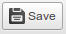
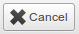

This repository houses 2 plugins for CKEditor: [inlinesave](#inlinesave) and [inlinecancel](#inlinecancel).

inlinesave
==========

http://ckeditor.com/addon/inlinesave

This plugin allows the user to save the content for a CKEditor inline editor via http POST.

###Usage

####1. Add the plugin to your editor. [Help](http://docs.ckeditor.com/#!/guide/dev_plugins)

####2. Set configuration options

The options are:
- `postUrl` (string; required): the url to send the data to, via http POST
- `postData` (object; optional): a JavaScript object containing additional data to send with the save; e.g.,` {test: true}`
- `onSave` (function; optional): function to call when the save button is pressed; editor element is passed into this function
- `onSuccess` (function; optional): function to call when data is sent successfully; editor element and http response data are passed into this function
- `onFail` (function; optional): function to call when data cannot be sent; the editor element, http status code, and [XMLHttpRequest](https://developer.mozilla.org/en-US/docs/Web/API/XMLHttpRequest) object are passed into this function
- `useJSON` (boolean; optional): when `true`, the plugin will send data to the server with Content-type 'application/json'; defaults to `false` and uses Content-type 'application/x-www-form-urlencoded' (see step #3)
- `useColorIcon` (boolean; optional): when `true`, icon will be green instead of gray

Sample configuration object (place this in your configuration file or use when initializing a new inline editor instance):

    config.inlinesave = {
      postUrl: '/myurl',
      postData: {test: true},                                                                              
      onSave: function(editor) { console.log('clicked save', editor); },                                   
      onSuccess: function(editor, data) { console.log('save successful', editor, data); },                 
      onFailure: function(editor, status, request) { console.log('save failed', editor, status, request); },
      useJSON: false,
      useColorIcon: false
    };

####3. Receive the data on your server.

By default, the data is sent with Content-type 'application/x-www-form-urlencoded' (this is the default type for HTML forms). However, if `config.inlinesave.useJSON` is set to `true`, then the Content-type will be 'application/json' and the data will be sent as a JSON object.

In either case, there are 2 fields you will always receive, in addition to those specified in the postData option:

- editabledata (string): the data being saved from the editor
- editorID (string): the identifier for the editor (useful for distinguishing between different editors)

Example data:

- editabledata: `'<h1>Hello world!</h1>\n\n
I&#39;m an instance of <a href="http://ckeditor.com">CKEditor</a>.
\n'`
- editorID: `'cke_editor'`
- test: `'true'`

Note that 'test' was an additional field specified in `config.inlinesave.postData` (as demonstrated in the example configuration above).

###Display label

If you want the label "Save" to display next to the icon, add the following css to your site:

    .cke_button_label.cke_button__inlinesave_label {
        display: inline;
    }

###Use Color Icon

If you set the `useColorIcon` configuration option to `true` (see above), the icon will be green instead of grey.

###More examples

If you would like to see more detailed examples and some neat uses for the plugin, check out [callbacks.md](https://github.com/tyleryasaka/inlinesave/blob/master/callbacks.md).

inlinecancel
==========

http://ckeditor.com/addon/inlinecancel

This is a simple cancel button for the CKEditor toolbar, designed to go along with the inlinesave addon (above). A custom `onCancel` function can be specified, allowing the developer to implement his/her own functionality for the button.

###Usage

####1. Add the plugin to your editor. [Help](http://docs.ckeditor.com/#!/guide/dev_plugins)

####2. Set configuration options

The options are:
- `onCancel` (function; optional): function to call when the button is clicked; editor element is passed into this function (can be used to manually undo changes; see [notes](#notes))
- `useColorIcon` (boolean; optional): when `true`, icon will be red instead of gray

Sample configuration object (place this in your configuration file):

    config.inlinecancel = {
      onCancel: function(editor) { console.log('cancel', editor); },
      useColorIcon: false
    };

###Display label

If you want the label "Cancel" to display next to the icon, add the following css to your site:

    .cke_button_label.cke_button__inlinecancel_label {
        display: inline;
    }

###Use Color Icon

If you set the `useColorIcon` configuration option to `true` (see above), the icon will be red instead of grey.

###Credits

Thanks to [@SteveTheTechie](https://github.com/SteveTheTechie) for contributing some snazziness to both of the addons
